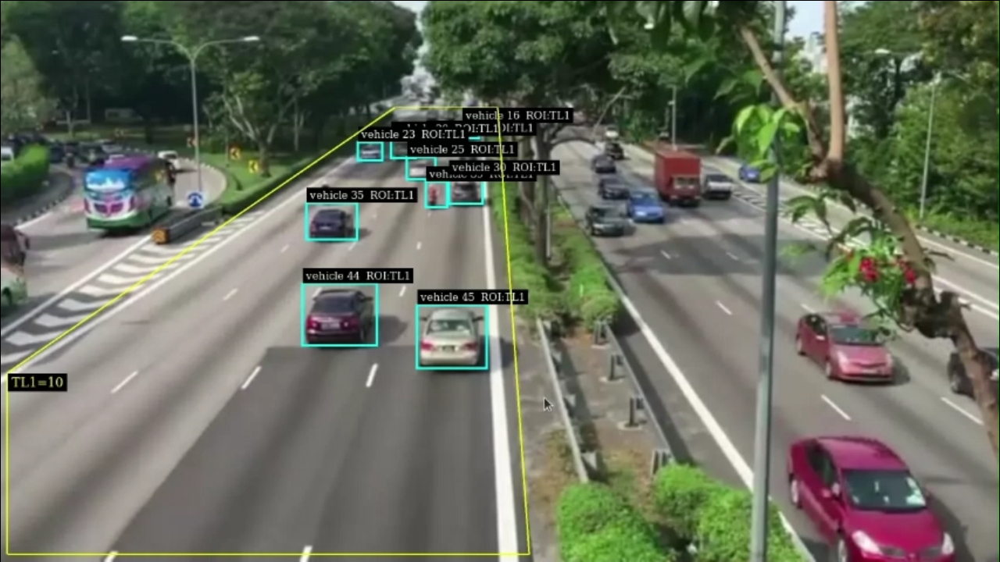

This repo demonstrates a deployment of an Nvidia Deepstream application to a Jetson device using AWS Greengrass V2

# Usage
## Prerequisites:

Nvidia Jetpack >=5.1.4
Deepstream SDK >= 6.0.3
Deepstream Python >= 1.18.0
AWS greengrassv2

If using Jetson, the following must be set up using Nvidia docs

1. Kafka Deepstream Adapter
2. RTSP Server
3. Triton Server

## Running Locally:

example usage:
```
python3 deepstream_app.py -i file://path/to/file/or/rtsp/stream --conn-str 'hostname;port;topic' -g nvinferserver -c config_infer_primary_rtdetr_triton.yml --silent -d rtsp
```

options:
--input, -i, path to input file or rtsp stream
--conn-str, kafka server connection string
--pgie, -g, inference engine, options: ["nvinfer", "nvinferserver"]
--configfile, -c, inference config file path
--silent, optional
--display, -d, display type, options: ["osd", "rtsp", "no-display"]
